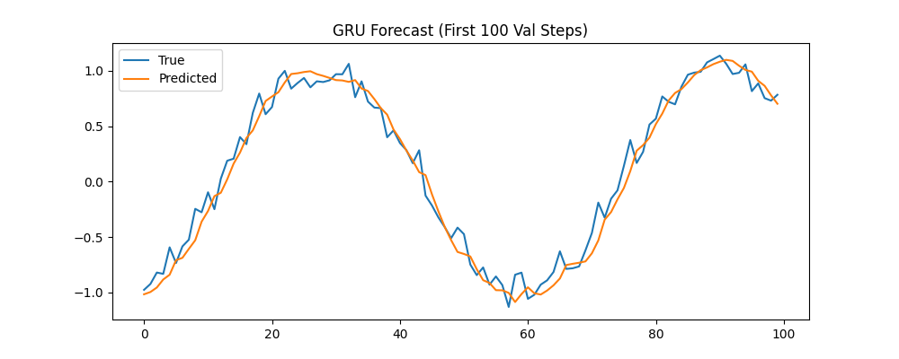
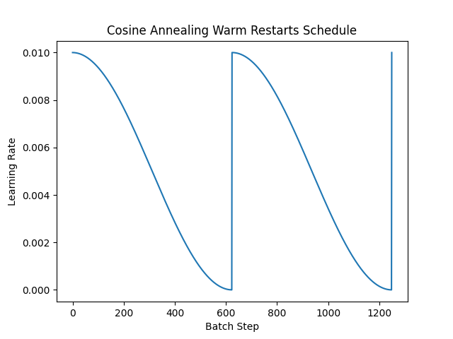
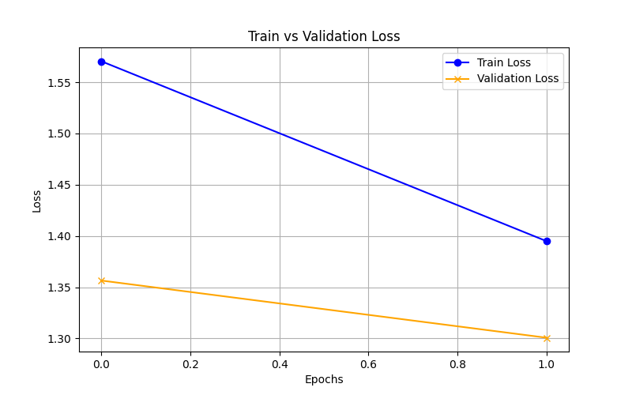
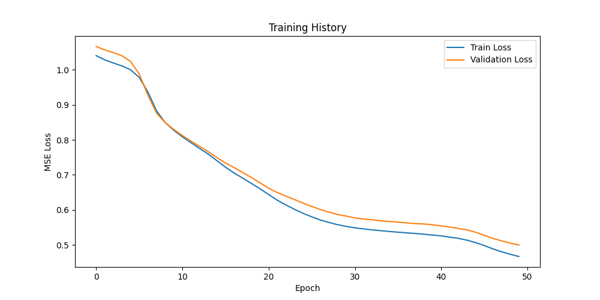
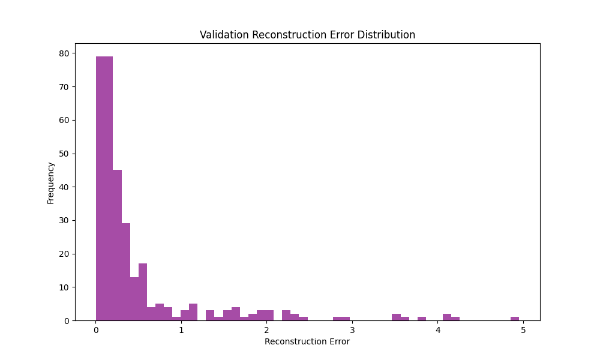
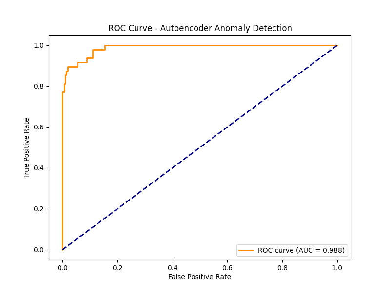

# Deep Learning Task Implementations

**Author:** Sakshat Patil  
**Program:** MS Software Engineering, San José State University  

## Overview
This repository contains four distinct deep learning tasks implemented from scratch using PyTorch. Each task strictly adheres to a self-evaluating protocol (`pytorch_task_v1`). Every script is completely self-contained: it loads data, builds the model architecture, executes the training loop, evaluates against specific quality thresholds, and returns an automated exit status.

---

## Task Results & Visualizations

### 1. Sequence Modeling: GRU Time Series Forecasting
*(File: `tasks/ts_lvl1_gru_sine/task.py`)* A sequential forecasting model utilizing a Gated Recurrent Unit (GRU). The network learns the underlying pattern of a noisy synthetic sine wave to predict future temporal values.


### 2. Optimization: AdamW & Cosine Annealing
*(File: `tasks/optim_lvl1_adamw_cosine/task.py`)* A Convolutional Neural Network (CNN) trained on image data to demonstrate modern optimization techniques. It replaces standard Adam with the AdamW optimizer and implements a Cosine Annealing Warm Restarts learning rate scheduler.



### 3. Anomaly Detection: Autoencoder
*(File: `tasks/anom_lvl4_autoencoder_anom/task.py`)* An unsupervised learning approach to anomaly detection. The script trains an encoder-decoder architecture to reconstruct normal data, calculates a dynamic threshold based on the F1 score, and uses the MSE reconstruction loss to flag anomalous data points.




### 4. Transfer Learning: MobileNetV2
*(File: `tasks/tl_lvl1_mobilenet_freeze/task.py`)* A computer vision transfer learning task. It imports a pre-trained MobileNetV2 model, freezes the core feature extraction layers, and trains a brand new custom classification head. *(Evaluated via console metrics).*

---

## How to Run

To execute a task and trigger the automated quality checks, run the script directly from the root directory. For example:

```bash
python tasks/optim_lvl1_adamw_cosine/task.py
